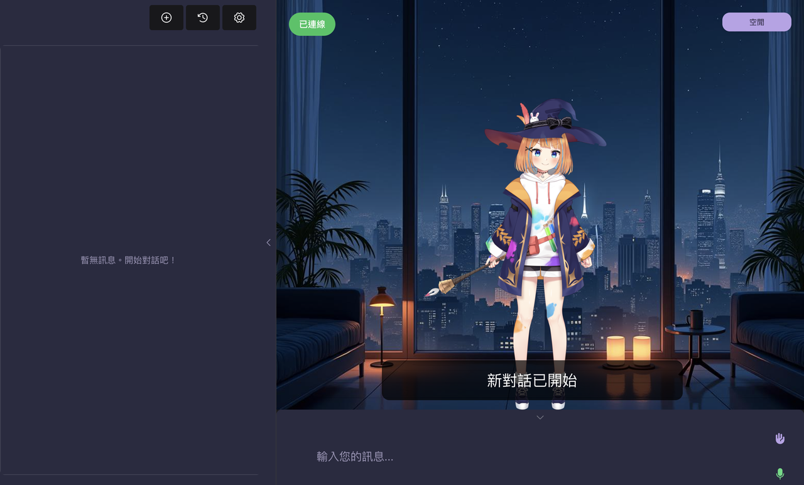
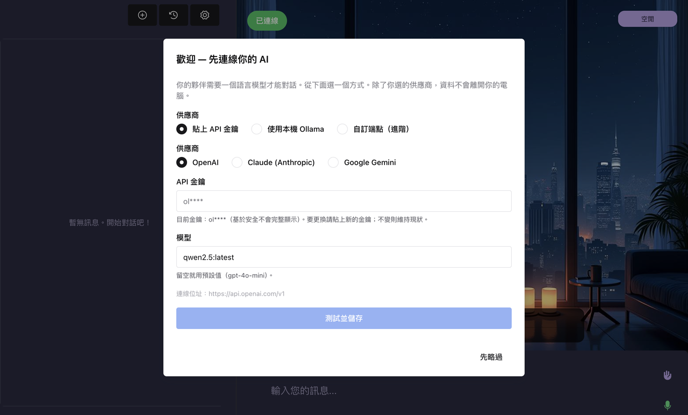

# Warashi

> A free, open-source, beginner-friendly **desktop AI companion** with a Live2D avatar — long-term memory, proactive chat, natural voice, and a sleep mode. Bring your own LLM; everything else works out of the box.

**Language:** **English** | [繁體中文](#繁體中文) | [日本語](./README.JP.md)


---

## What is this?

**Warashi** turns an on-screen Live2D character into an AI companion you actually talk to — it remembers you, starts conversations on its own, listens while you speak, and goes quiet when you say goodnight.

It is a **friendly re-packaging** of the excellent [Open-LLM-VTuber](https://github.com/Open-LLM-VTuber/Open-LLM-VTuber) project. We stand on its shoulders: upstream provides the rock-solid Live2D + ASR/TTS + LLM plumbing; this fork wraps it into a **download → double-click → chat** experience for non-technical users, and adds a memory system, proactive conversation, natural barge-in voice, character management, an in-app setup wizard, and a fully bilingual (English / 繁體中文) UI.

**Our principles — and what we deliberately do NOT do:**

- **Free and open source, with optional donations.** No paid tier, no paywall.
- **No mobile version.** Desktop only (macOS / Windows).
- **No model marketplace / bundled copyrighted characters.** This avoids the Live2D commercial-licensing trap — we ship only neutral free defaults; you bring your own character, voice, and LLM.

> Built on Open-LLM-VTuber. See [`NOTICE`](./NOTICE) for full attribution and component licenses, and [`README.upstream.md`](./README.upstream.md) for the original project's docs.

---

## Features

- **Long-term memory** — it remembers who you are and what you're working on, and gets to know you over time. A curated per-character "core memory" is injected into the persona; after each turn the LLM decides what's worth saving. Updates take effect immediately (no restart). Tunable memory cap.
- **Deep recall (FTS5 trigram)** — opt-in full-history search across everything you've ever said, with proper CJK support.
- **Proactive topics** — after a stretch of silence it opens a topic on its own. Optionally pull the latest AI / tech / anime / gaming news to chat about (pure stdlib helper, **no API key needed**).
- **Natural barge-in voice chat** — talk any time; you don't have to wait for the mic, and you can cut it off mid-sentence like a real conversation.
- **Sleep / do-not-disturb mode** — say "晚安" (goodnight) and it stops initiating; it resumes the next time you talk to it. The keyword is configurable.
- **Character management** — create / edit / switch / delete characters: name + persona + Live2D skin + voice + its own separate memory.
- **First-run setup wizard** — paste an API key (OpenAI / Claude / Gemini) or pick a local Ollama model. The wizard runs a quick test call before saving.
- **LLM settings tab** — Ollama mode lets you type a model name by hand, so you can use cloud models too (e.g. `gpt-oss:cloud`).
- **Performance presets** — Light / Standard / High-performance, bundling ASR/TTS engine choice + memory-consolidation frequency + model keep-alive.
- **Cross-language translation** — optional subtitle / voice translation (off by default).
- **Works out of the box** — bundled sample Live2D model + free cloud TTS (edge-tts) + auto-downloaded small ASR model. You only have to plug in an LLM.
- **Fully bilingual UI** — Traditional Chinese (zh) and English (en).

---

## Screenshots



*Warashi running on the desktop: a Live2D avatar you actually talk to.*

---

## Quick start (download → double-click → chat)

The easy path — **no terminal needed.**

> **Before you start: you'll need an AI "brain" (LLM).**
> Warashi is the **body and face** — the avatar, the voice, the memory. The **brain** that actually thinks and talks is a separate AI that *you* provide. You pick one of two ways, and you can set it up during the setup wizard (no need to decide everything right now):
> - **(A) Use a paid cloud AI** — get an API key from [OpenAI](https://platform.openai.com/api-keys), Claude, or Gemini and paste it in. With a small model this typically costs only **pennies per chat**.
> - **(B) Run a free local AI** — install the free **[Ollama](https://ollama.com)** app and it runs a brain right on your own computer. **No cost**, but it needs a reasonably capable computer.
>
> You don't need to download anything yet — just know which way you're leaning before you wait through the install below.

1. **Download Warashi.** Go to the [**Releases page**](https://github.com/inni918/warashi/releases/latest) and download the latest `Warashi-*.zip`, then unzip it (e.g. to your Desktop). _(Alternatively, on the main repo page click the green **`<> Code`** button → **Download ZIP**.)_
2. **Double-click the launcher** inside the unzipped folder:
   - **macOS:** `start-companion.command`
   - **Windows:** `start-companion.bat`
   - The first launch installs everything (`uv`, then dependencies) and can take a few minutes. **Leave that window open — it's the server.**
3. Your browser opens to **http://localhost:12393**. On first run a **setup wizard** appears: either **paste an API key** (OpenAI / Claude / Gemini) **or** **pick a local Ollama model**. The wizard tests your choice before saving.

   

   *The first-run setup wizard, where you plug in your AI "brain".*

4. **Restart so your new brain kicks in.** Quit by **closing that same launcher/terminal window from step 2** (that stops the server), then **double-click the launcher again** to start it back up with your new LLM. (The app also notes that an LLM change "takes effect after a restart — or after switching the character once.") Then start chatting; click once on the page to enable audio.

> **macOS Gatekeeper (first launch only):** double-clicking may show *"can't be opened because it is from an unidentified developer."* This is normal for an unsigned open-source app. **Right-click** `start-companion.command` → **Open** → **Open** in the dialog. After you allow it once, double-clicking works from then on. (We don't ship a signed/notarized build — this is the free tier.)

> **Windows SmartScreen (first launch only):** double-clicking may show a blue **"Windows protected your PC"** box. This is normal for an unsigned open-source app. Click **More info** → **Run anyway**. After you allow it once, it won't ask again.

Out of the box it uses the bundled **mao** sample Live2D model and **edge-tts** (free cloud voice, no GPU needed). The first run also downloads a small speech-to-text model automatically.

### Prefer the terminal? (advanced)

Most people should use the **Download ZIP** path above. If you're comfortable with a terminal, you can clone the repo instead. Requires **Python ≥ 3.10, < 3.13** and [`uv`](https://github.com/astral-sh/uv).

```bash
git clone https://github.com/inni918/warashi.git && cd warashi
uv sync                  # installs dependencies
uv run run_server.py     # start the server
# open http://localhost:12393  → setup wizard → chat
```

The wizard writes your LLM choice into `conf.yaml` for you. You can still edit it by hand (see below).

---

## LLM setup (required)

You need **either** an API key for a cloud LLM **or** a running local LLM. A cheap model is plenty for companion chat — you do not need a flagship.

### Option A — Cloud API key (OpenAI / Claude / Gemini)

Easiest. In the **first-run setup wizard** (or the **LLM settings tab** later), paste your API key for OpenAI, Claude, or Gemini. The wizard validates it with a quick test call, then writes it into `conf.yaml`. **Restart the launcher after saving** for the new LLM to take effect.

### Option B — Local Ollama

Install [Ollama](https://ollama.com), pull a model (e.g. `ollama pull qwen2.5`), then choose Ollama in the wizard / settings tab. Fully local, no API key, no cloud cost.

### Option C — Cloud models through Ollama (e.g. `gpt-oss:cloud`)

Ollama can also proxy certain **cloud** models. In **Ollama mode you can type the model name by hand**, including cloud names ending in `:cloud` (e.g. `gpt-oss:cloud`).

> **Important:** cloud models through Ollama require you to be signed in first — run **`ollama signin`** in a terminal before using them, or the call will fail.

### ⚠️ Reasoning ("thinking") models are NOT supported

Reasoning models such as **`glm-4.7:cloud`** put their answer in a separate `reasoning` field and leave the normal `content` field **empty**. This app reads only `content`, so a reasoning model will show up as a **blank reply** — and since there's nothing to read aloud, **no voice either**.

**Recommendation:** pick a normal (non-reasoning) chat model. A small, fast model gives a more natural, lower-latency companion anyway.

> Manual edit: the LLM config lives under `character_config → agent_config → llm_configs → openai_compatible_llm` in `conf.yaml`. Comments in the file show how to point at OpenAI / Claude / Gemini with your own key. Restart the launcher after editing.

---

## Other settings

### Memory (core + deep recall)
On by default. Each character keeps its own memory at `chat_history/<conf_uid>/core_memory.md` — persona-injected core memory plus per-turn LLM consolidation (the model decides what to keep). Opt-in **FTS5 trigram deep recall** searches your full history when you want longer-term memory. Tune the memory cap in settings.

### Characters
Create / edit / switch / delete characters in the app — each has its own name, persona, Live2D skin, voice, and **separate memory**. To add your own Live2D model, drop it under `live2d-models/<name>/`, add an entry in `model_dict.json`, and select it. **Do not commit copyrighted character models to a public repo.**

#### More characters (optional)
For licensing safety, Warashi bundles only **3 free Live2D Original Characters** (`mao_pro`, `haru`, `hiyori`). Want more — including the male butler character **Natori**? You can download free official Live2D sample models yourself from the official page and drop them in. Get them from **[Live2D's sample models page](https://www.live2d.com/en/learn/sample/)** under Live2D's own license — we don't redistribute them. See [`docs/add-live2d-character.md`](docs/add-live2d-character.md) for the how-to.

### Performance presets
**Light / Standard / High-performance** presets bundle the ASR/TTS engine choice, memory-consolidation frequency, and model keep-alive. Pick Light on a modest machine, High-performance if you have the hardware.

### Proactive topics & news
The companion opens topics after idle time. Optionally refresh those topics with current headlines via the bundled news helper (`scripts/news_topics.py`) — pure stdlib, no API key — and schedule it (cron / launchd / Task Scheduler), e.g. every few hours.

### Sleep / quiet mode
Say "晚安" to stop it initiating; it resumes on your next message. The keyword is configurable.

### Translation
Optional cross-language subtitle/voice translation, **off by default** (`tts_preprocessor_config → translator_config` in `conf.yaml`).

### Voice
Default is **edge-tts** (free, no hardware). For a high-quality local/custom voice, run [GPT-SoVITS](https://github.com/RVC-Boss/GPT-SoVITS) as a service and point the config at it (needs a GPU or Apple Silicon). Voice-cloning a real person's voice is your legal responsibility.

---

## Guides

- [Use it from your phone / tablet (Tailscale)](docs/remote-access-tailscale.md) — reach your companion from another device, even off your home network.
- [Custom voice with GPT-SoVITS](docs/custom-voice-gpt-sovits.md) — give your character a cloned or custom voice.
- [Add your own Live2D character](docs/add-live2d-character.md) — drop a model in and switch to it.

## Credits & license

This project would not exist without the upstream work it builds on. Please **star and support [Open-LLM-VTuber](https://github.com/Open-LLM-VTuber/Open-LLM-VTuber)** too.

- **Upstream:** [Open-LLM-VTuber](https://github.com/Open-LLM-VTuber/Open-LLM-VTuber) — its server-side code is MIT, Copyright (c) 2025 Yi-Ting Chiu.
- **This fork's additions** (memory, proactive topics, barge-in, quiet mode, character management, setup wizard, performance presets, bilingual UI) — MIT.
- **Bundled web frontend** — the compiled web bundle in `frontend/` is the Open-LLM-VTuber-Web frontend, under the **Open-LLM-VTuber License 1.0** (Apache-2.0 + additional conditions). Free, non-commercial use and redistribution is permitted; commercial rebranding, paid hosting/SaaS, or embedding in a paid product needs a separate commercial license from the Open-LLM-VTuber org. This fork is free and non-commercial, which the license permits. See [`NOTICE`](./NOTICE).
- **Live2D Cubism & bundled sample models** — the bundled **mao_pro** / **haru** / **hiyori** models are Live2D Inc. sample data, used under the **Live2D Free Material License** (see [`LICENSE-Live2D.md`](./LICENSE-Live2D.md)). Required attribution:
  > This content uses sample data owned and copyrighted by Live2D Inc.

  They are bundled **unmodified** as a free default. **For any paid/commercial build, replace them** with your own CC0 / licensed / commissioned model.
- **Other components** (see [`NOTICE`](./NOTICE) for each license): GPT-SoVITS (MIT, optional TTS), sherpa-onnx (Apache-2.0, ASR engine — the SenseVoice model has its own license; or use Whisper), Silero VAD (MIT), edge-tts (uses Microsoft's online TTS service), DeepLX (unofficial DeepL endpoint — use the official DeepL API for production).

**Do not ship copyrighted characters, artwork, voices, or trained voice models.** This repo ships only neutral defaults; bring your own.

### License

This fork's own source code is released under the **MIT License**, on top of Open-LLM-VTuber's MIT-licensed server code (Copyright (c) 2025 Yi-Ting Chiu). However, **the whole project is not simply MIT**: the bundled compiled web frontend in `frontend/` is under the **Open-LLM-VTuber License 1.0** (Apache-2.0 + additional conditions), and the bundled Live2D sample models carry their own Live2D terms. See [`LICENSE`](./LICENSE), [`NOTICE`](./NOTICE), and [`LICENSE-Live2D.md`](./LICENSE-Live2D.md) for the full, accurate picture.

---

## Support this project

This is a free, open-source project — no paywall. If it's useful to you, a tip is appreciated but never required:

- **Ko-fi:** [ko-fi.com/leonhsueh](https://ko-fi.com/leonhsueh)
- **GitHub Sponsors:** coming soon

And please support the upstream project this is built on — [Open-LLM-VTuber](https://github.com/Open-LLM-VTuber/Open-LLM-VTuber).

---

## Contributing

Issues and pull requests are welcome.

- File bugs and feature ideas in **Issues**.
- For code changes, open a **Pull Request** with a clear description.
- Please **do not** add copyrighted characters, artwork, voices, or trained voice models — keep the repo shippable as neutral defaults only.

---
---

# 繁體中文

**語言：** [English](#warashi) | **繁體中文** | [日本語](./README.JP.md)

## 這是什麼？

**Warashi** 把一個 Live2D 角色變成你真的會去聊天的 AI 桌面陪伴：它記得你、會自己開話題、你說話時它會聽、你說「晚安」它就安靜下來。

它是把優秀的開源專案 [Open-LLM-VTuber](https://github.com/Open-LLM-VTuber/Open-LLM-VTuber) 重新打包成**對小白友善**的版本。我們站在它的肩膀上：上游提供穩定的 Live2D + 語音辨識/合成 + LLM 底層，這個 fork 則把它包成「**下載 → 雙擊 → 開聊**」的體驗，並加上長期記憶、主動話題、自然插話語音、角色管理、首次啟動設定精靈，以及完整的中英雙語介面。

**我們的原則 — 以及我們刻意不做的事：**

- **免費開源 + 捐款**：沒有付費版、沒有付費牆。
- **不做手機版**：只做桌面（macOS / Windows）。
- **不做模型市集、不附帶有版權的角色**：藉此避開 Live2D 商用授權的陷阱 — 我們只附中性的免費預設，角色、語音、LLM 都由你自己帶。

> 本專案建構於 Open-LLM-VTuber 之上。完整致謝與各元件授權見 [`NOTICE`](./NOTICE)，原專案文件保留於 [`README.upstream.md`](./README.upstream.md)。

## 功能亮點

- **長期記憶**：它會記得你是誰、你在忙什麼，並隨時間越來越了解你。每個角色有一份「核心記憶」注入人設；每輪結束後由 LLM 決定哪些值得存下來。更新即時生效，不用重啟。記憶上限可調。
- **深度回想（FTS5 trigram）**：可選開啟，全歷史搜尋你說過的每句話，完整支援中日韓文字。
- **主動話題**：沉默一段時間後它會自己開話題。可選擇抓最新的 AI／科技／動漫／遊戲新聞來聊（純標準函式庫，**不需要 API key**）。
- **自然插話語音對話**：隨時都能開口，不必等麥克風，也能像真人對話一樣中途打斷它。
- **睡眠／勿擾模式**：說「晚安」它就停止主動發話，下次你跟它說話時恢復。關鍵字可改。
- **角色管理**：建立／編輯／切換／刪除角色 — 名稱＋人設＋Live2D 皮＋語音＋各自獨立的記憶。
- **首次啟動設定精靈**：貼上 API key（OpenAI／Claude／Gemini）或選本地 Ollama 模型，存檔前會先做一次測試呼叫。
- **LLM 設定分頁**：Ollama 模式可手動填模型名，因此也能用雲端模型（如 `gpt-oss:cloud`）。
- **效能預設**：輕量／標準／高效能三檔，一鍵搭配好 ASR/TTS 引擎＋記憶整理頻率＋模型常駐。
- **跨語言翻譯**：可選的字幕／語音翻譯（預設關閉）。
- **開箱即用**：內建範例 Live2D 模型＋免費雲端語音（edge-tts）＋自動下載的小型語音辨識模型，你只要插上一個 LLM。
- **完整中英雙語介面**：繁體中文（zh）與英文（en）。

## 截圖


*Warashi 在桌面上運作：一個你真的會去聊天的 Live2D 角色。*

## 快速開始（下載 → 雙擊 → 開聊）

最簡單的路徑，**完全不用終端機。**

> **開始前先準備好：你需要一顆 AI「大腦」（LLM）。**
> Warashi 是**身體和臉** — 角色外型、聲音、記憶都有了。但真正會思考、會講話的**大腦**，是一個另外的 AI，要由**你**來提供。你二選一就好，而且可以在設定精靈裡再設定（現在不用全部決定）：
> - **（A）用付費的雲端 AI** — 去 [OpenAI](https://platform.openai.com/api-keys)、Claude 或 Gemini 拿一把 API key 貼進去。用小模型的話，通常**一次聊天只要幾分錢**。
> - **（B）跑免費的本地 AI** — 安裝免費的 **[Ollama](https://ollama.com)** app，它就在你自己的電腦上跑一顆大腦。**完全免費**，但需要一台還算夠力的電腦。
>
> 現在還不用先下載什麼，只要在等下面安裝跑完之前，心裡有個方向就好。

1. **下載 Warashi。** 到 [**Releases 頁面**](https://github.com/inni918/warashi/releases/latest) 下載最新的 `Warashi-*.zip`，然後解壓縮（例如解到桌面）。_（或者在 repo 主頁點綠色 **`<> Code`** 按鈕 → **Download ZIP**。）_
2. **雙擊資料夾裡的啟動器**：
   - **macOS：** `start-companion.command`
   - **Windows：** `start-companion.bat`
   - 第一次啟動會自動安裝所有東西（先 `uv`，再相依套件），可能要幾分鐘。**那個視窗別關，它就是伺服器本體。**
3. 瀏覽器會自動開到 **http://localhost:12393**。第一次會出現**設定精靈**：**貼上 API key**（OpenAI／Claude／Gemini），**或**選一個本地 **Ollama 模型**。精靈會先測試再存檔。

   

   *首次啟動的設定精靈，在這裡接上你的 AI「大腦」。*

4. **重啟一次，新的大腦才會接上。** 請**把步驟 2 那個啟動器／終端機視窗關掉**結束它（這會停掉伺服器），再**重新雙擊一次啟動器**，讓新的 LLM 接上。（app 裡也會提示，LLM 的變更「會在重啟之後生效 — 或切換一次角色之後生效」。）接著就能開始聊天；點一下頁面以解鎖音訊。

> **macOS Gatekeeper（僅第一次）：** 雙擊時可能跳出「**無法打開，因為來自未識別的開發者**」。這對未簽章的開源 app 是正常的。請對 `start-companion.command` **按右鍵 → 打開 → 打開**。允許一次之後，往後就能直接雙擊了。（我們不提供簽章／公證版本 — 這是免費版。）

> **Windows SmartScreen（僅第一次）：** 雙擊時可能跳出藍色的「**Windows 已保護您的電腦**」視窗。這對未簽章的開源 app 是正常的。請點 **其他資訊** → **仍要執行**。允許一次之後就不會再問了。

開箱使用內建的 **mao** 範例 Live2D 模型與 **edge-tts**（免費雲端語音，不需顯卡）。第一次啟動也會自動下載一個小型語音辨識模型。

### 習慣用終端機？（進階）

大多數人用上面的 **Download ZIP** 路徑就好。如果你熟悉終端機，也可以改用 clone 取得專案。需要 **Python ≥ 3.10、< 3.13** 與 [`uv`](https://github.com/astral-sh/uv)。

```bash
git clone https://github.com/inni918/warashi.git && cd warashi
uv sync                  # 安裝相依套件
uv run run_server.py     # 啟動伺服器
# 開 http://localhost:12393  → 設定精靈 → 開聊
```

## LLM 設定（必做）

你需要**擇一**：雲端 LLM 的 API key，**或**一個本地 LLM。陪伴聊天用便宜的模型就很夠，不需要旗艦級。

- **方案 A — 雲端 API key（OpenAI／Claude／Gemini）**：最簡單。在設定精靈（或之後的 LLM 設定分頁）貼上 key，精靈測試通過後寫進 `conf.yaml`。**存檔後重啟啟動器**才會生效。
- **方案 B — 本地 Ollama**：安裝 [Ollama](https://ollama.com)、拉一個模型（如 `ollama pull qwen2.5`），在精靈選 Ollama。完全本地、不用 key、零雲端費用。
- **方案 C — 透過 Ollama 用雲端模型（如 `gpt-oss:cloud`）**：Ollama 模式可**手動填模型名**，包含 `:cloud` 結尾的雲端模型。
  > **重要：** 用雲端模型前必須先登入，請在終端機執行 **`ollama signin`**，否則呼叫會失敗。

### ⚠️ 思考型（reasoning）模型不適用

像 **`glm-4.7:cloud`** 這類思考型模型，會把答案放在另一個 `reasoning` 欄位，而一般的 `content` 欄位是**空的**。這個 app 只讀 `content`，所以思考型模型會顯示成**空白回覆** — 沒有文字可念，**語音也不會出聲**。

**建議：** 選一個一般（非思考型）的對話模型。小而快的模型反而讓陪伴更自然、延遲更低。

## 其他設定

- **記憶（核心＋深度回想）**：預設開啟，每個角色記憶獨立存在 `chat_history/<conf_uid>/core_memory.md`，每輪由 LLM 決定要存什麼；可選開啟 **FTS5 深度回想**搜尋全歷史。記憶上限可在設定調整。
- **角色**：在 app 內建立／編輯／切換／刪除，每個角色有獨立的名稱、人設、Live2D 皮、語音與記憶。要加自己的模型，放到 `live2d-models/<name>/` 並在 `model_dict.json` 加一筆。**不要把有版權的角色模型 commit 進公開 repo。**
  - **想要更多角色（選用）**：為了授權安全，Warashi 只內建 **3 個免費的 Live2D 原創角色**（`mao_pro`、`haru`、`hiyori`）。想要更多 — 包含男管家角色 **Natori（名取）**？你可以自己到官方頁面下載免費的官方 Live2D 範例模型再放進來。請從 **[Live2D 範例模型頁面](https://www.live2d.com/en/learn/sample/)** 依 Live2D 自己的授權下載 — 我們不代為散布。作法見 [`docs/add-live2d-character.md`](docs/add-live2d-character.md)。
- **效能預設**：輕量／標準／高效能，一鍵搭好引擎、整理頻率與模型常駐。
- **主動話題與新聞**：可用 `scripts/news_topics.py`（純標準函式庫、不需 key）定時更新話題。
- **睡眠／勿擾**：說「晚安」停止主動發話，下次對話恢復，關鍵字可改。
- **翻譯**：可選的跨語言字幕／語音翻譯，預設關閉。
- **語音**：預設 edge-tts（免費、不需硬體）；要高品質本地／自訂語音可接 GPT-SoVITS（需顯卡或 Apple Silicon）。克隆真人聲音的法律責任由你自負。

## 教學

- [從手機／平板遠端使用（Tailscale）](docs/remote-access-tailscale.md) — 即使不在家，也能從別的裝置開啟你的虛擬角色。
- [用 GPT-SoVITS 自訂聲音](docs/custom-voice-gpt-sovits.md) — 讓角色用克隆或自訂的聲音說話。
- [自己加 Live2D 角色](docs/add-live2d-character.md) — 把模型放進來並切換使用。

## 致謝與授權

沒有上游就沒有這個專案，也請去 **star 並支持 [Open-LLM-VTuber](https://github.com/Open-LLM-VTuber/Open-LLM-VTuber)**。

- **上游：** [Open-LLM-VTuber](https://github.com/Open-LLM-VTuber/Open-LLM-VTuber) — 其伺服器端程式碼為 MIT，Copyright (c) 2025 Yi-Ting Chiu。
- **本 fork 新增的部分**（記憶、主動話題、插話、勿擾、角色管理、設定精靈、效能預設、雙語介面）— MIT。
- **內建前端：** `frontend/` 裡的編譯後網頁是 Open-LLM-VTuber-Web 前端，採 **Open-LLM-VTuber License 1.0**（Apache-2.0 + 額外條款）。免費、非商業的使用與再散布是被允許的；商業改名、付費託管／SaaS、或內嵌進付費產品，則需向 Open-LLM-VTuber 團隊另取商業授權。本 fork 免費且非商業，符合該授權允許的範圍。見 [`NOTICE`](./NOTICE)。
- **Live2D Cubism 與內建範例模型：** 內建的 **mao_pro** / **haru** / **hiyori** 為 Live2D Inc. 範例資料，依 **Live2D 無償提供材料授權**使用（見 [`LICENSE-Live2D.md`](./LICENSE-Live2D.md)），必須保留致謝句：
  > This content uses sample data owned and copyrighted by Live2D Inc.

  它們以**未修改**形式作為免費預設附帶。**任何付費／商用版本都必須替換**成你自己的 CC0／已授權／委託製作的模型。
- **其他元件**（各授權見 [`NOTICE`](./NOTICE)）：GPT-SoVITS（MIT，選用 TTS）、sherpa-onnx（Apache-2.0，ASR 引擎；SenseVoice 模型另有授權，或改用 Whisper）、Silero VAD（MIT）、edge-tts（使用微軟線上語音服務）、DeepLX（非官方 DeepL 端點，正式環境請改用官方 DeepL API）。

**請勿散布有版權的角色、美術、語音或訓練過的語音模型。** 本 repo 只附中性預設，其餘自己帶。

### License

本 fork 自己寫的程式碼以 **MIT 授權**釋出，建構於 Open-LLM-VTuber 同為 MIT 授權的伺服器端程式碼之上（Copyright (c) 2025 Yi-Ting Chiu）。但**整個專案並非單純的 MIT**：`frontend/` 裡內建的編譯後網頁前端採 **Open-LLM-VTuber License 1.0**（Apache-2.0 + 額外條款），而內建的 Live2D 範例模型另有其 Live2D 授權條款。完整且準確的內容見 [`LICENSE`](./LICENSE)、[`NOTICE`](./NOTICE) 與 [`LICENSE-Live2D.md`](./LICENSE-Live2D.md)。

## 支持本專案

這是免費開源專案，沒有付費牆。如果它對你有幫助，歡迎（但絕非必須）小額贊助：

- **Ko-fi:** [ko-fi.com/leonhsueh](https://ko-fi.com/leonhsueh)
- **GitHub Sponsors:** 即將開放

也請支持本專案所建構於的上游 — [Open-LLM-VTuber](https://github.com/Open-LLM-VTuber/Open-LLM-VTuber)。

## 貢獻指南

歡迎開 issue 與 pull request。

- bug 與功能想法請開 **Issue**。
- 程式碼變更請開 **Pull Request** 並清楚說明。
- 請**不要**加入有版權的角色、美術、語音或訓練過的語音模型，讓 repo 維持可發布的中性預設狀態。
